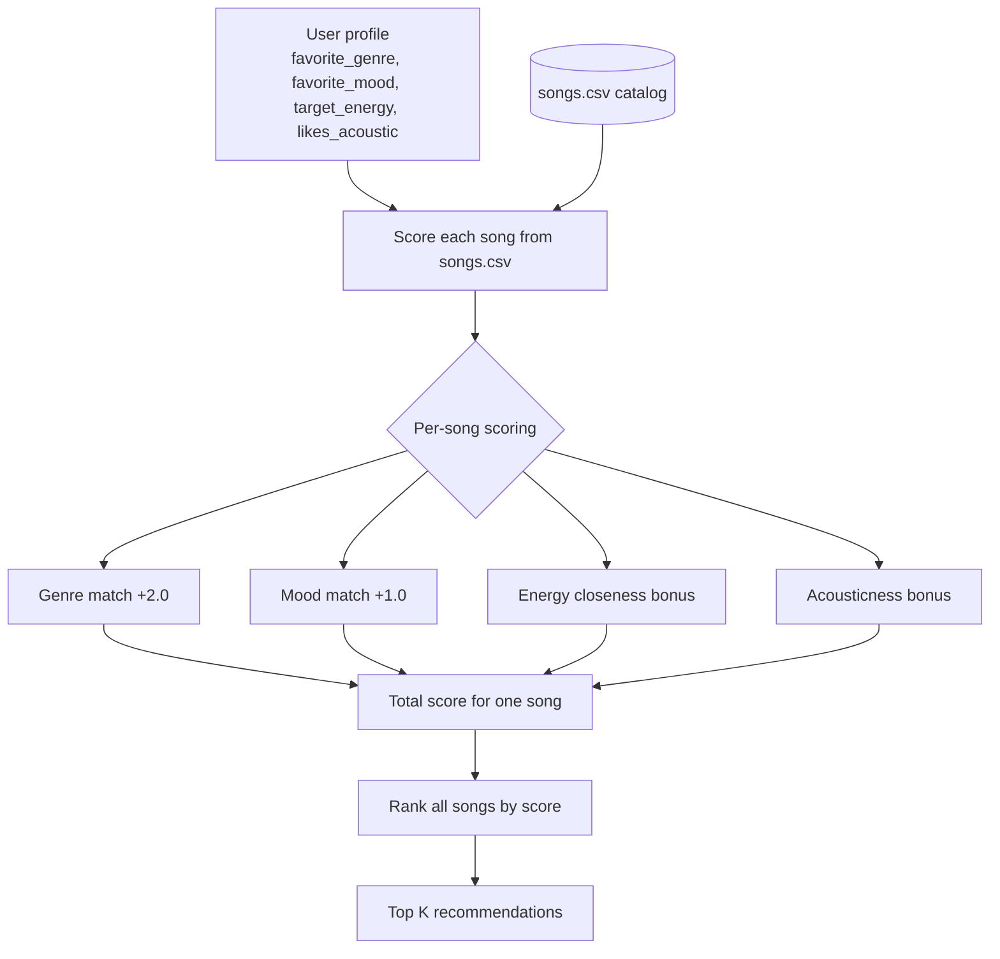

# 🎵 Music Recommender Simulation

## Project Summary

This project builds a small music recommender that predicts what a user might like next from song attributes such as genre, mood, energy, tempo, valence, danceability, and acousticness. The goal is to make the recommendation logic easy to inspect and explain.

---

## How The System Works

Real streaming platforms usually mix collaborative filtering, which learns from other users' behavior, with content-based filtering, which looks directly at song attributes. Systems like Spotify or YouTube may use signals such as likes, skips, replays, playlists, watch time, genre, tempo, mood, and similarity to past behavior to predict what someone will enjoy next.

This simulator prioritizes the content-based side because the catalog is small and the behavior should stay transparent. It scores one song at a time by comparing the song's features to a user profile, then ranks all songs by total score and returns the top K recommendations.

My starting taste profile is:

- favorite_genre: lofi
- favorite_mood: chill
- target_energy: 0.40
- likes_acoustic: true

This profile should distinguish chill lofi from intense rock because it favors low-energy, acoustic, relaxed tracks while still allowing nearby matches.

### Algorithm Recipe

- +2.0 points for a genre match.
- +1.0 point for a mood match.
- Up to +2.0 points for energy closeness, with closer songs getting more points.
- Add a small bonus when acousticness matches the user's preference.
- Rank songs by total score and return the top K.

### Potential Biases

This system might over-prioritize genre and mood labels, causing it to miss songs that fit the user's vibe even when they are not an exact category match. It may also favor songs that look similar to the starter catalog and under-represent users whose taste is more diverse or unusual.

### Data Flow



---

## Getting Started

### Setup

1. Create a virtual environment (optional but recommended):

   ```bash
   python -m venv .venv
   source .venv/bin/activate      # Mac or Linux
   .venv\\Scripts\\activate      # Windows
   ```

2. Install dependencies

   ```bash
   pip install -r requirements.txt
   ```

3. Run the app:

   ```bash
   python -m src.main
   ```

### Running Tests

Run the starter tests with:

```bash
pytest
```

You can add more tests in `tests/test_recommender.py`.